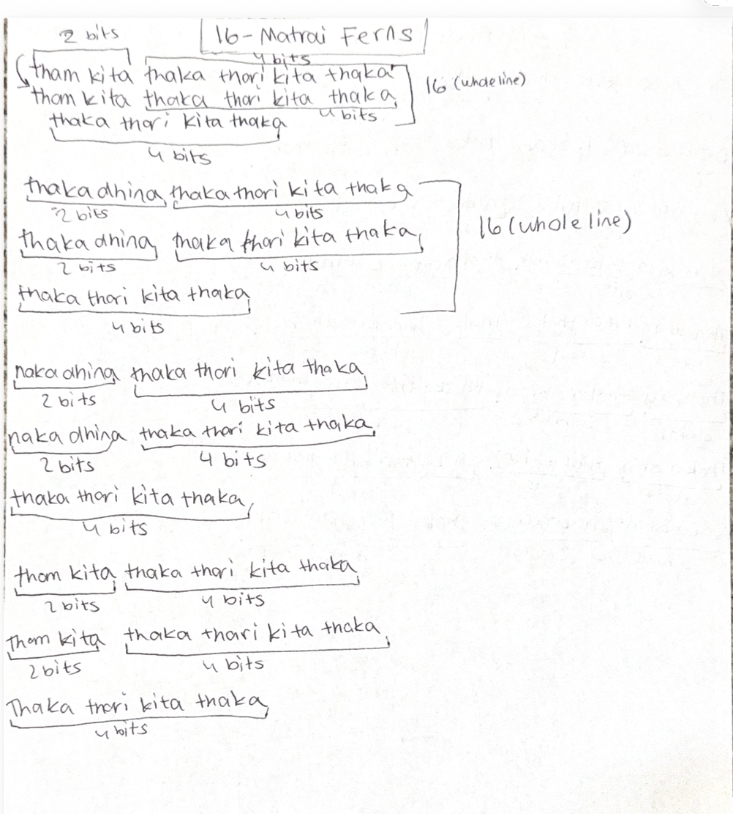

# Lesson 2: Understanding 16-Matrai in Mridangam

[⬅ Back to Carnatic Lessons](carnatic-lessons.html)

---

## What is a 16-Matrai Pattern?

In Carnatic rhythm, a matrai is a unit of time or beat.  
In this lesson, I practiced rhythm patterns where each line must total **16 matrais**.

Compared to 8-matrai patterns, 16-matrai cycles are longer and require stronger internal counting and control.  
Even though the syllables change, the total count must always remain **16**.

This helped me understand how longer rhythmic cycles are structured and balanced.

---

## My Lesson Notes

In this lesson, I wrote patterns to understand how different groupings combine to form 16 matrais.  
I also started observing how longer cycles require more concentration to maintain timing and structure.

Each pattern must always total 16 matrais.

---

## Original Handwritten Notes

---

## Download Original Notes (PDF)
[Open PDF](docs/16matrai.pdf)

---

## Patterns I Practiced (typed from notes)

Tha kita thaka thari kita thaka
Thom kita thaka thari kita thaka
Thaka thari kita thaka

---

## Understanding the Structure

While learning this lesson, I noticed that longer cycles require careful counting and spacing.

There are many ways to make 16:

8 + 8  
4 + 4 + 4 + 4  
2 + 2 + 4 + 8  
Different combinations are possible, but the total must remain **16**.

This showed me that rhythm has structure similar to grouping and counting in mathematics.

---

## Thinking in Units and Groups

When writing these patterns, I began thinking of rhythm in grouped units:

2 matrai = small unit  
4 matrai = structured grouping  
8 matrai = half cycle  
16 matrai = full cycle  

Each rhythm line must complete the full 16-matrai cycle correctly.

---

## What Happens When Speed Changes?

If played faster:
- more strokes fit into the same cycle  
- counts divide into smaller internal units  

If played slower:
- counts expand into longer units  
- spacing between beats increases  

Even when speed changes, the structure must still total 16 matrais.

---

## Early Connections I Notice (Patterns & Logic)

While practicing 16-matrai patterns, I noticed that rhythm follows structure and counting rules.

Different groupings can create the same total:

8 + 8  
4 + 4 + 4 + 4  
2 + 2 + 4 + 8  

This feels similar to mathematics where different combinations can produce the same result.

Maintaining rhythm requires:
- counting accuracy  
- pattern recognition  
- structured grouping  
- consistency across cycles  

---

## What My Teacher Explained

My teacher explained that longer cycles like 16 matrais require strong internal counting and control.  
Each pattern must resolve correctly at the end of the cycle and return to the starting point.

This reinforced the importance of structure, grouping, and balance in rhythm.

---

## How This Lesson Made Me Think Further

This lesson helped me see that rhythm involves:
- patterns  
- grouping  
- timing  
- structure  
- repetition  

These ideas made me curious about how rhythm connects with mathematics, logical thinking, and computer science concepts such as structured sequences and timing.

I will continue documenting these observations as I learn more.

You can also read my ongoing thoughts here:

**Music, Math & Computer Science**
