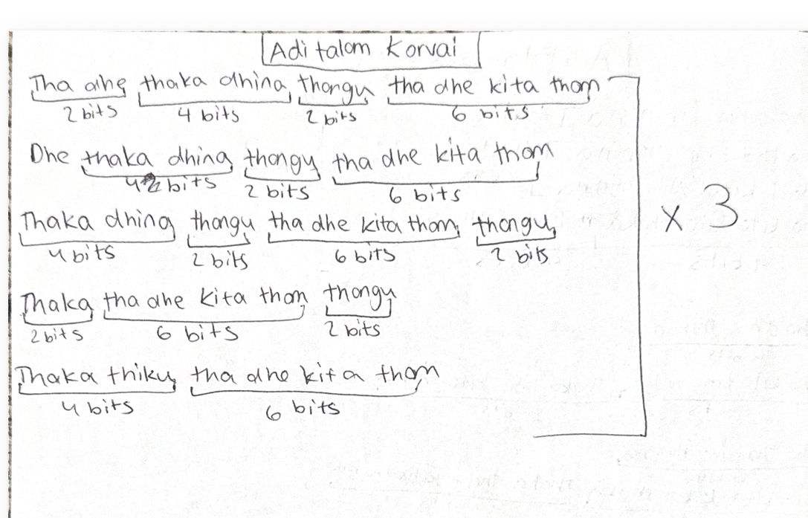

# Lesson 4: Adi Tala Korvai

[⬅ Back to Carnatic Lessons](carnatic-lessons.md)

---

## What is a Korvai?

A korvai is a structured rhythmic pattern that is repeated and completed to land precisely on the starting beat of the tala cycle.

In this lesson, I practiced a korvai in Adi Tala, which follows an 8-beat cycle.  
The goal of a korvai is to maintain structure, repetition, and correct landing at the end of the cycle.

---

## Tala Structure (Adi Tala)

Adi Tala follows an 8-beat cycle:

1 2 3 4 | 5 6 | 7 8

The korvai must fit within this structure and resolve correctly at the end of the cycle.

---

## Original Handwritten Notes

---

## Download Original Notes (PDF)
[Open PDF](docs/adithalam-korvai.pdf)

---

## Patterns I Learned (typed from my notes)

The following korvai patterns repeat and resolve within the Adi Tala cycle.

Tha ka dhi mi Tha ka jo nu | Tha dhin gi na thom (repeat)

Tha dhin gi na thom Tha ka dhi mi | Tha dhin gi na thom (repeat)

Tha ka dhi mi | Tha ka dhi mi | Tha dhin gi na thom (final landing)

Each pattern is repeated in structured sequences and must land correctly at the start of the tala cycle.

All korvai patterns must resolve accurately within the Adi Tala structure.

## Understanding the Korvai Structure

While practicing korvai patterns, I noticed that repetition and structure are very important.

A korvai usually follows this format:

pattern → repeated sequence → final landing

Each repetition must stay aligned with the tala cycle, and the final phrase must land correctly on the starting beat.

This requires careful counting and consistency.

---

## Thinking in Repetition and Cycles

A korvai uses repetition and structure.

For example:
pattern → repeat → repeat → final landing  

This showed me that rhythm can be built using repeating structured sequences.

Maintaining alignment across repetitions improves timing and control.

---

## Early Connections I Notice (Patterns & Logic)

Practicing korvai patterns feels similar to structured sequences where:

- steps repeat  
- timing must remain consistent  
- final result must land at correct position  

This made me think about how repetition and structure are important in both rhythm and logical systems.

---

### How I Structured This Korvai

While writing this korvai, I did not only memorize the syllables. I broke each phrase into counted units such as 2, 4, or 6 matrais.

This helped me clearly see:

- how long each phrase is  
- how phrases combine into a larger sequence  
- how the sequence repeats  
- where the final landing occurs  

By writing the korvai in grouped counts, I could predict whether the full structure would resolve correctly within the Adi Tala cycle.

Instead of thinking only in sound, I began thinking in structure.

### Repetition and Multiplication

Because the phrase is repeated ×3, I must calculate:

phrase length × number of repetitions + final resolving phrase

The total must align with the 8-beat Adi Tala cycle.

### Planning the Resolution

In Adi Tala, the cycle has 8 beats.

If the total number of matrais in the korvai does not align correctly with the cycle, the final stroke will not land on the starting beat.

Before playing, I must calculate:

- total matrais across repetitions  
- how the pattern moves across cycles  
- whether the final landing occurs on samam  

If the structure does not resolve correctly, I must adjust the grouping.

This requires prediction and careful counting.

### Simple Structural Model

Total cycle = 8 beats

Korvai structure:
(grouped phrase × repetitions) + final landing phrase

If the total aligns with the tala cycle → resolves correctly ✔  
If not → the structure must be adjusted ✘

This helped me understand that korvai follows clear structural and logical rules.

### What This Helped Me Realize

Learning korvai showed me that rhythm is not only about repetition, but about prediction and structured resolution.

A korvai must be designed before it is played.

This strengthened my ability to:

- think ahead  
- calculate totals  
- adjust structures  
- execute with precision  

I began to see rhythm as a system where planning and execution must work together.

In this handwritten korvai, I grouped each phrase into counted units (2, 4, 6) to understand how the full structure resolves within the tala cycle.

---

### Music, Math, and Computer Science Connection

This lesson connects to mathematical and computational thinking.

See full connections here:  
➡️ [Music → Math → Computer Science Connections](music-math-cs-connections.md)

