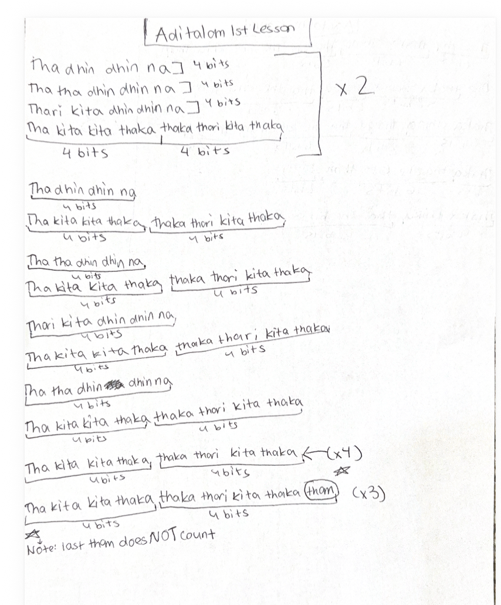

# Lesson 3: Adi Tala (Ādi Tāḷa) – 8 Beat Cycle

[⬅ Back to Carnatic Lessons](carnatic-lessons.md)

---

## What is Adi Tala?

Adi Tala is one of the most common tala structures in Carnatic music.  
It is an **8-beat cycle** and is often counted in grouped structure.

Even though it totals 8 beats, the internal grouping helps maintain structure and flow.

---

## Tala Structure (8 Beats)

A common way to count Adi Tala is:

1 2 3 4 | 5 6 | 7 8

This grouping helps maintain alignment across the cycle.

---

## Original Handwritten Notes

---

## Download Original Notes (PDF)
[Open PDF](docs/adithalam-lesson1.pdf)

---

## Patterns I Learned (typed from my notes)

Each of the following patterns fits within the Adi Tala cycle (8 beats).

Tha ka dhi mi | Tha ka jo nu (4 + 4)

Tha dhin gi na thom | Tha ka dhi mi (4 + 4)

Tha ka dhi mi | Tha dhin gi na thom (4 + 4)

Tha dhin gi na thom | Tha dhin gi na thom (4 + 4)

Each pattern must stay aligned with the 8-beat Adi Tala cycle.

All patterns must resolve correctly before the cycle repeats.

## Understanding the Adi Tala Structure

While practicing Adi Tala, I noticed that each pattern must align with the full 8-beat cycle.

There are different ways to group the beats:

4 + 2 + 2  
2 + 2 + 2 + 2  
4 + 4  

Even when the internal grouping changes, the total must remain within the Adi Tala cycle.

This helped me understand how tala provides a structured framework for rhythm.

---

## Understanding the Structure

While practicing Adi Tala, I noticed that:
- each cycle must complete all 8 beats
- patterns can be grouped in different ways (4+2+2, 2+2+2+2, etc.)
- the most important part is landing correctly when the cycle repeats

This helped me understand how tala cycles create a stable structure for rhythm.

---

## Early Connections I Notice (Patterns & Logic)

Adi Tala feels like a repeating loop:
- the cycle repeats every 8 beats
- internal grouping helps keep structure
- accuracy depends on counting and consistent timing

This is similar to pattern-based thinking where repetition and alignment matter.

---

### Structural Understanding of Adi Tāḷa

While practicing Adi Tāḷa, I began to see it as a structured system rather than just a rhythm pattern.

The total cycle always remains 8 beats, but the internal grouping can change:

4 + 2 + 2  
2 + 2 + 2 + 2  
4 + 4  

Even when the internal structure changes, the total must always resolve to 8 before the cycle repeats.

This helped me understand how a stable structure can allow flexibility inside it, as long as the overall system remains balanced.

### Understanding Cycles and Repetition

Adi Tāḷa repeats continuously in a cycle.

Each pattern must begin and end at the correct point before the next cycle starts.  
If the pattern does not resolve correctly, it affects the next cycle.

This showed me how repeating systems depend on correct alignment at the end of each cycle.  
Even small timing differences can affect the full structure if they are not corrected.

---
### Simple Logical Model

Total cycle = 8  

Valid patterns:
- 4 + 4 = 8 ✔  
- 4 + 2 + 2 = 8 ✔  
- 2 + 2 + 2 + 2 = 8 ✔  

If a pattern becomes:
- 4 + 4 + 2 = 10 ✘  

It does not resolve correctly and must be adjusted.

This showed me how rhythmic structure follows clear mathematical and logical rules.

This helped me see rhythm not just as music, but as a structured system that must stay consistent while allowing creative variation inside it.

---
## Reflection (to be added gradually)

### What This Helped Me Realize

Practicing Adi Tāḷa helped me become more aware of repeating structures and alignment.

Even when patterns change, the system must stay consistent and return to the starting point correctly.  
This requires careful attention, counting, and planning across the full cycle.

I began to see rhythm not just as sound, but as a structured system that repeats with consistency and balance.

This lesson helped me see how repeating systems depend on accuracy, alignment, and consistency across cycles.

### Music, Math, and Computer Science Connection

This lesson connects to mathematical and computational thinking.

See full connections here:  
➡️ [Music → Math → Computer Science Connections](music-math-cs-connections.md)
