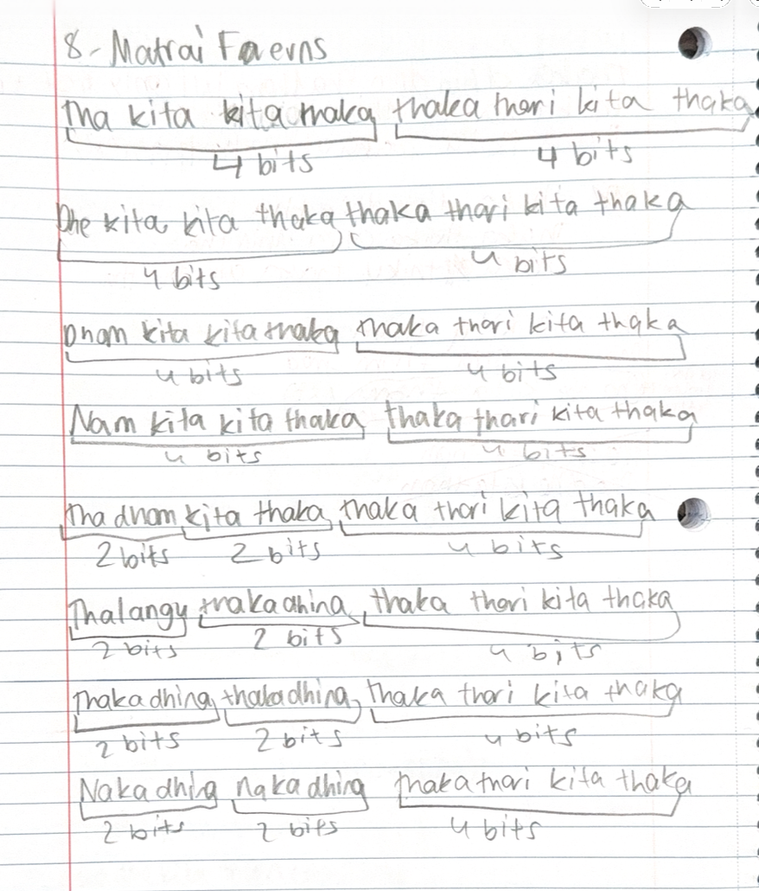

## Carnatic Rhythm Lessons – Learning Through Mridangam

# Carnatic Rhythm Lessons – Mridangam Practice

This section documents structured mridangam lessons that I have practiced over several years of training.  
Each lesson includes original handwritten notes, structured rhythm patterns, and explanations of tala and matrai.

These lessons reflect long-term discipline and help me understand rhythm as structured patterns built on timing and repetition.

---

## Lesson Index

### Matrai Structure Lessons
- [8 Matrai Rhythm Structure](lessons/8-matrai.md)
- [16 Matrai Rhythm Structure](lessons/16-matrai.md)

### Tala Lessons
- [Adi Tala](lessons/adi-tala.md)
- [Adi Tala Korvai](lessons/adi-tala-korvai.md)
- [Rupaka Tala](lessons/rupaka-tala.md)
- [Rupaka Tala Korvai](lessons/rupaka-korvai.md)

### Chapu Tala Lessons
- [Kanda Chapu](lessons/kanda-chapu.md)
- [Mishra Chapu](lessons/mishra-chapu.md)
- [Mishra Chapu Korvai](lessons/mishra-chapu-korvai.md)

---

## About These Lessons
All lessons shown here are based on actual practice and handwritten notes.  
Over time, I will continue adding reflections and exploring how rhythm connects with patterns, mathematics, and structured thinking.

---

## Lesson 1: Understanding 8-Matrai in Mridangam

### What is an 8-Matrai Pattern?

In Carnatic rhythm, a matrai is a unit of time or beat.
In this lesson, I started learning rhythm patterns where each line must total 8 matrais.

Even though the syllables and sounds change, the total count must always remain 8.
This helped me understand that rhythm has structure and balance, not just sound.

This is my first step in understanding how mridangam rhythm connects to counting, patterns, and structured thinking.

### My First Lesson Notes
During this lesson, I wrote down patterns in my own way to understand how they add up to 8 matrais.
I also started grouping them into smaller counted units like 4 and 2 to make it easier to follow.

Each pattern must always total 8 matrais, even if the internal grouping changes.

Download original handwritten notes (PDF):  
[Open PDF](docs/8matrai.pdf)

### Patterns I Learned (typed from my notes)

Each of the following patterns equals 8 matrais.

Tha kita kita taka | Thari kita taka
(4 + 4)

Dhe kita kita thaka | Thaka thari kita thaka
(4 + 4)

Nam kita kita taka | Thaka thari kita thaka
(4 + 4)

Nam kita kita thaka | Thaka thari kita thaka
(4 + 4)

Na dhin kita thaka
(2)

Naka thari kita thaka
(2 + 4)

Nakadhinga thakadhinga | Thaka thari kita thaka
(2 + 2 + 4)

All patterns must add up to 8 matrais total.

### Understanding the Structure
While learning this lesson, I noticed that even though the syllables change, the total number of matrais always stays the same.

There are many ways to make 8:

    4 + 4
    2 + 2 + 4
    2 + 4 + 2 

Different combinations are possible, but the total must remain balanced at 8.
This showed me that rhythm has structure similar to counting and grouping in math.

### Thinking in Units and Groups

When I was writing my notes, I started thinking of rhythm as grouped units.

    2 matrai = small rhythmic group
    4 matrai = half cycle
    8 matrai = full cycle

So each rhythm line becomes:
     4 + 4 = 8
or
     2 + 2 + 4 = 8

This grouping helped me understand and remember patterns more clearly.

### What Happens When Speed Changes?

In this lesson I also learned that rhythm can be played at different speeds.

If played faster:

     - counts divide into smaller grouped units
     - more strokes fit into the same cycle

If played slower:

    - counts expand into larger grouped units
    - each beat becomes longer

Even when speed changes, the structure must still total 8 matrais.

This showed me that rhythm also involves ideas similar to multiplication, division, and structured grouping.

### Early Connections I Notice (Math & Logical Thinking)
While learning this lesson, I started noticing that rhythm follows structure and counting.

Each pattern must always total 8, even if the internal grouping changes.

For example:

    4 + 4
    2 + 2 + 4

different combinations but same total

This feels similar to math where different numbers can add up to the same result.

When speed changes:
   playing faster divides grouped counts
   playing slower expands grouped counts

This made me realize rhythm also uses ideas like multiplication, division, and structured grouping.

### What My Teacher Explained About Structure
During this lesson, my teacher explained that in mridangam patterns we do not use a single isolated unit by itself.
The rhythm must always be grouped into structured counts such as 2 or 4 matrais to maintain balance and flow.

This helped me understand that there is always a minimum valid grouping needed to form a stable rhythm pattern.
A single unit by itself does not create a complete rhythmic structure in this lesson.

When I thought about this more, it reminded me of how systems in math and computer science also follow rules and constraints.
In computing, data and instructions are usually organized into structured blocks instead of isolated single units, and systems must follow minimum valid groupings.

Seeing this idea in rhythm made me realize that both music and computing depend on structure, grouping, and valid patterns.

This lesson is my starting point in exploring how rhythm, math, computer science and logical thinking connect as I continue learning mridangam.

---

## How This Lesson Made Me Think Further

While learning this 8-matrai lesson, I began noticing that rhythm involves patterns, grouping, structure, and synchronization.

These ideas made me curious about how rhythm might connect to mathematical thinking and computer science concepts such as structure, timing, and logical patterns.

I have started recording my observations and questions as I continue learning.

I have started recording these observations here:

Music, Math & Computer Science

You can read my ongoing thoughts here:  
[Music, Math & Computer Science](music-math-cs.md)

---
## Korvai (Structured Pattern)

A korvai is a structured rhythmic pattern that fits within a tala cycle. Practicing korvais taught me how smaller patterns combine to form longer sequences and how precision matters at transition points.

---

## Practice and Discipline

Carnatic rhythm requires daily practice and attention to posture, hand position, and sound quality. Through practice, I learned patience and consistency, and I am still improving every day.
