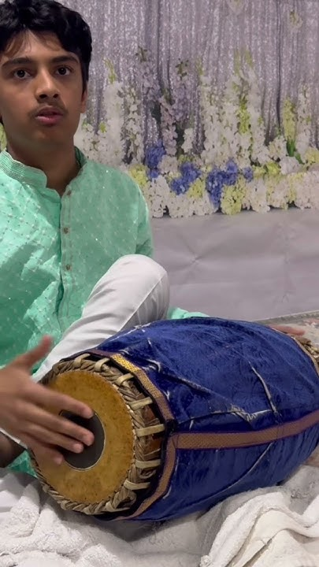
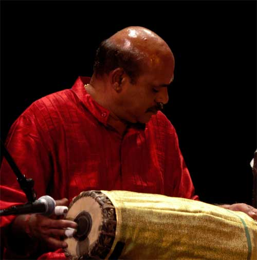

# Rishi Vedula — Mridangam, Rhythm, and Structured Thinking
## Exploring rhythm patterns through music, mathematics, and engineering thinking

## Project Navigation

- [Project Purpose](purpose.md)    - [Instruments I Play](instruments.md)   - [Carnatic Rhythm Lessons](carnatic-lessons.md)   - [Rhythm Patterns](patterns.md)     - [Notes / Research Log](notes.md)  
- [Music → Math → Computer Engineering](music-math-cs.md)    - [Media & Timeline](media.md)

This portfolio documents my long-term journey learning rhythm through mridangam and percussion.
I am especially interested in how rhythm connects with patterns, mathematics, and structured thinking.

*Practice session during my learning journey*

---

## My Journey with Mridangam

---

***Mridangam (pronounced: MREE-dun-gum)*** is a classical percussion instrument used in South Indian Carnatic music. Traditionally, it accompanies vocalists and instrumentalists and provides the rhythmic foundation for performances. For centuries it has been an important part of musical and cultural traditions in South India, especially in temple events and classical concerts. The instrument is known for its complex rhythmic patterns and precise hand techniques.

I was introduced to Carnatic music in 2017 when my family was living in Orlando, Florida and I was in 3rd grade. My parents often took my sister and me to temples and weekend community programs. Like most kids, we enjoyed playing outside, but my parents also wanted us to stay connected to Indian culture. Around that time, they learned about teachers in our community who taught Indian classical arts such as Bharatanatyam and Mridangam. What started as a weekend activity slowly became something much more meaningful in my life, even though I did not realize it at first.

My Mridangam teacher is Sri Venupuri Srinivas, the founder of Navarasa Academy. From the beginning, he emphasized discipline, strong fundamentals, and long-term commitment to the art. He always reminded students and parents that learning Mridangam is a lifelong journey and cannot be rushed.

When I first started learning Mridangam, it was very difficult. My teacher required correct posture, proper hand position, and focused practice for long periods of time. Sitting on the floor for extended periods was uncomfortable at first and required a lot of concentration. Breaks were short, and expectations were high.

My dad supported me by sitting next to me during daily practice. My teacher was very direct with both parents and students and often reminded us that progress takes years of patience and consistent effort. At the time, I felt his teaching style was strict, but as I grew older, I realized that it came from deep respect for the art and for his students.

The first six months were the hardest. My teacher constantly corrected finger placement and hand movement. Later he explained how each position produces a different sound and meaning. I did not fully understand these details in my first year, but over time I began to appreciate how precise and structured rhythm really is.

My first stage performance was during a Lord Ayyappa temple event, where devotees were observing Ayyappa Swamy Deeksha. My teacher organized a small group of students, including me, to perform together. Playing in front of an audience and receiving encouragement from the community motivated me to continue learning seriously.

Over time I also saw how strong the student community around my teacher was — not only in Orlando but also in cities such as Tampa and Jacksonville. Students from many places felt proud to learn from him.

In 2020, I participated in another major performance during the Navarasa Academy annual event, where we performed for about ten minutes. Shortly after that, COVID began, and learning Mridangam became even more challenging.

Teaching such a hands-on instrument over Zoom felt almost impossible. However, my teacher adapted quickly. He guided parents on how to position cameras and microphones so he could observe hand movements and hear sound clearly. Even with limited visuals, he could identify mistakes simply by listening carefully. This showed me how deeply he understands rhythm.

I continued learning Mridangam online for nearly two years. When my family later moved to Katy, Texas, my parents asked if he could continue teaching me remotely. Although he was hesitant at first, he agreed, and I am proud that I am still learning from him today.

Along the way, I was also exposed to other percussion instruments. In middle school I learned snare drum, marimba, mallets, and synthesizer. I began to notice similarities between Western percussion and Mridangam, even though one uses sticks and the other uses hands. In high school I joined the band program and played snare drum for school performances.

Over time, Mridangam became more than just music for me. It became a daily discipline and a way of thinking. Through rhythm I learned patience, repetition, structure, and precision. These ideas continue to influence how I approach learning and problem-solving today.

After many years of practice, I began noticing something interesting. Many rhythm patterns seemed similar to ideas I was learning in mathematics — cycles, repetition, symmetry, and structured sequences. These same types of patterns also appear in engineering fields such as computer engineering and electrical systems, where signals, timing, and binary patterns are used to build computing systems.

This observation made me curious about how musical rhythm might connect to mathematics, memory, logical thinking, and computational systems. This website documents my journey learning Mridangam and explores how rhythm, patterns, and structured thinking may relate to ideas used in mathematics and engineering.

---

## About My Teacher

**Sri Venupuri Srinivas** is a Mridangam artist and the founder of **Navarasa Academy**, where he teaches Carnatic rhythm with a strong focus on fundamentals, discipline, and long-term growth. Together with his wife, who teaches Bharatanatyam, he has built a close-knit learning community connecting students and families across multiple cities.

An external profile describing his background and contributions to the performing arts (written by others) can be found here:

### Teacher & Academy Links

| Resource | Link |
|---------|------|
| Navarasa Academy of Performing Arts (Official Facebook Page) | [Visit Facebook Page](https://www.facebook.com/p/NAVARASA-ACADEMY-OF-PERFORMING-ARTS-100063500260793/) |
| Sri Venupuri Srinivas – Artist Profile & Contributions | [View External Profile](https://www.sooryaperformingarts.org/venupuri-srinivas/) |

*Learning rhythm under my teacher’s guidance*

---
## What This Project Documents

This portfolio documents my long-term learning journey in Carnatic rhythm, structured thinking, and pattern analysis.

It includes:

• Detailed tala and korvai lessons  
• Structured rhythm breakdowns  
• Connections between music, mathematics, and computer science & engineering
• Research notes and observations  
• Practice recordings and progress tracking  

The goal is to understand rhythm not only as music, but as a structured system involving logic, pattern recognition, and timing.

- [Project Purpose](purpose.md)    - [Instruments I Play](instruments.md)   - [Carnatic Rhythm Lessons](carnatic-lessons.md)   - [Rhythm Patterns](patterns.md)     - [Notes / Research Log](notes.md)  
- [Music → Math → Computer Engienering](music-math-cs.md)    - [Media & Timeline](media.md)

## Project Repository:  
This project is maintained as a structured GitHub portfolio documenting long-term learning and exploration.

## GitHub Repository:  

🔗 **[GitHub Repository](https://github.com/rishivedula-09/rishi-vedula-mridangam-portfolio)**

---

### AI Assistance Note

Artificial intelligence tools were occasionally used during this project to assist with research, brainstorming ideas, and organizing content while building this GitHub website. The rhythm demonstrations, practice recordings, and reflections presented here represent my own learning journey studying the mridangam.

----

