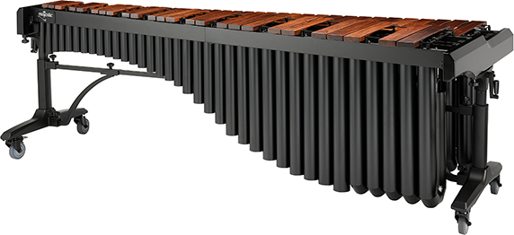

# Instruments I Play - Percussion, Rhythm, and Patterns

In this section, I explore how different percussion instruments create rhythm in unique ways.
By learning mridangam, snare drum, and marimba, I am beginning to see how rhythm connects across cultures, patterns, and structured thinking.
This exploration helps me understand music not just as sound, but as a system of patterns and logic.

---
### 🔗 Navigate this page
**Jump to:**  
[Introduction](#1-introduction-my-interest-in-rhythm) • 
[Instruments](#2-instruments-i-explore) • 
[Comparison](#3-comparing-percussion-instruments) • 
[Rhythm Observations](#4-what-i-notice-about-rhythm-across-instruments) • 
[Math & Logic](#5-rhythm-and-mathematical-thinking) • 
[Mridangam](#mridangam) • 
[Snare Drum](#snare-drum) • 
[Marimba](#marimba)
---

## 1. Introduction: My Interest in Rhythm

I have always been interested in rhythm and how patterns are created in music.
Learning percussion made me realize that rhythm is not just about keeping time — it is about understanding patterns, cycles, and structure.

As I continue learning, I have become curious about how rhythm works across different musical traditions and instruments. I am also interested in how rhythm connects to logical thinking, mathematics, and patterns.

This page documents my exploration of percussion instruments and how they help me understand rhythm in both musical and analytical ways.

## 2. Instruments I Explore

To understand rhythm more deeply, I am exploring different percussion instruments from different musical traditions.

These include:
- [Mridangam](#mridangam)
- [Snare Drum](#snare-drum)
- [Marimba](#marimba)
            
**Mridangam** – Classical Carnatic percussion instrument  
**Snare Drum** – Western rhythm and marching percussion  
**Marimba** – Melodic percussion combining rhythm and pitch

Each instrument approaches rhythm differently, but all of them require timing, coordination, and pattern recognition. Exploring multiple instruments helps me see how rhythm is structured and performed across cultures.

## 3. Comparing Percussion Instruments

Each percussion instrument has a unique role and style, but they share common rhythmic ideas.

| Instrument | Musical Tradition | Role in Music | How Rhythm is Created |
|------------|------------------|--------------|-----------------------|
| Mridangam | South Indian Carnatic music | Maintains tala cycles and complex rhythmic patterns | Hand techniques and tonal variation |
| Snare Drum | Western orchestral and marching traditions | Maintains tempo and rhythmic accents | Stick patterns and rudiments |
| Marimba | Global orchestral and percussion ensembles | Combines melody and rhythm | Mallet patterns across notes |

Although these instruments come from different cultures, they all depend on timing, repetition, and structured patterns.

## 4. What I Notice About Rhythm Across Instruments

While exploring these instruments, I started noticing some common ideas about rhythm.

### Rhythm uses repeating patterns

All percussion instruments use repeating patterns and cycles.
These patterns help create structure and predictability in music.

### Rhythm requires precision

Timing must be accurate.
If a pattern is slightly off, it changes the overall rhythm.

### Rhythm is structured
Rhythm follows organized systems rather than random sounds.
Each instrument has its own way of creating structured rhythmic patterns.

These observations made me curious about how rhythm connects with mathematical and logical thinking.

## 5. Rhythm and Mathematical Thinking

As I continue learning percussion, I am beginning to see connections between rhythm and mathematics.

### Counting and Subdivision

Rhythms divide time into equal parts:
      Whole beats
      Half beats
      Quarter beats
      Smaller subdivisions

This is similar to fractions and division in mathematics.

### Repeating Sequences

Many rhythm exercises repeat patterns:

      Tha ka dhi mi | Tha ka dhi mi
      R L R L | R L R L

These repeating sequences are similar to mathematical patterns and sequences.

### Symmetry and Balance

Some rhythm patterns are balanced or symmetrical.

This is similar to symmetry in mathematics where patterns mirror each other.

### Cycles and Loops

Rhythm cycles repeat continuously.

For example, an 8-beat cycle repeats again after it ends.

This is similar to loops in computer programming.

### Logical Structure

Playing rhythmic patterns requires following steps in the correct order and timing.

This feels similar to logical thinking and structured problem solving.

Exploring rhythm through different instruments helps me understand how music connects with patterns, numbers, and logical structure.

---
I began my rhythm journey with the mridangam, which is deeply connected to Carnatic music and traditional rhythmic systems

---

## Mridangam

*Traditional Carnatic percussion instrument*

##  Mridangam: Rhythm, Culture, and Mathematical Thinking

##  1. What is the Mridangam?

### The mridangam is a classical percussion instrument from South India and the primary rhythm instrument used in Carnatic music. It is a double-sided drum played with both hands and can produce both bass and sharp tonal sounds.

The word mridangam comes from Sanskrit:
mrid – clay or earth
anga – body
Early versions were made using clay, while modern mridangams are made from wood and leather. The instrument is designed to create a wide range of rhythmic sounds and patterns.
While learning the mridangam, I am developing rhythm accuracy, coordination, and the ability to recognize complex patterns in sound.

## 2. Cultural and Historical Significance
###  The mridangam has a long history in Indian classical music and is sometimes called a “divine instrument” (Deva Vadyam).

In traditional stories and temple sculptures, it is associated with classical performances and divine musicians.
Because of its importance in Carnatic music, the mridangam is often considered the main percussion instrument in a Carnatic concert. It supports vocalists and instrumentalists by maintaining rhythm and enhancing the musical experience.
This cultural history makes learning the mridangam feel like being part of a long musical tradition.

## 3. My Journey Learning Mridangam

I started learning mridangam because I was interested in rhythm and Carnatic music.
As I continued practicing, I realized that mridangam is not just about keeping time — it involves understanding patterns, cycles, and structure.

Practicing regularly has helped me:
      Improve concentration
      Develop discipline
      Recognize repeating patterns
Listen carefully to rhythm changes

I also began noticing connections between rhythm patterns and mathematical thinking.

## 4. Understanding Rhythm in Carnatic Music
In Carnatic music, rhythm follows structured cycles called tāla.
Each tāla has a fixed number of beats that repeat.

For example, Adi Tāla has 8 beats:

      1 2 3 4 | 5 6 | 7 8

The mridangam artist plays patterns within these cycles and must end at the correct beat.
This requires counting, timing, and precision.

      Tha ka dhi mi

Learning these patterns feels like working with structured sequences.

## 5. How Rhythm Connects to Math and Logic

### While learning mridangam, I started seeing rhythm as patterns and numbers.

Many rhythm exercises involve:
        
        Dividing beats into smaller units
        Repeating patterns
        Ending exactly on the correct beat

This feels similar to solving math or logic problems.

Some rhythm patterns must repeat multiple times and still land perfectly on the final beat, which reminds me of loops and sequences in programming.
This made me curious about how music, math, and computer science are connected.

## 6. My Research and Exploration

### To learn more about the mridangam and its cultural and musical significance, I explored these resources:

| Topic | Resource | Link |
|------|---------|------|
| Mridangam overview & cultural context | Layapriya – Mridangam | https://layapriya.ca/mridangam/ |
| History and structure | Wikipedia – Mridangam | https://en.wikipedia.org/wiki/Mridangam |

These resources helped me understand the history, structure, and role of the mridangam in Carnatic music and rhythm.

##  7. What I Want to Explore Next
####  In the future, I want to explore:
        How rhythm patterns relate to mathematical sequences
        How music and computer science connect
        How different percussion instruments approach rhythm

This website documents my learning journey and my exploration of rhythm, patterns, and logic.

⬆️ Back to top: [Navigation](#instruments-i-play---percussion-rhythm-and-patterns)

---

---

## Snare Drum

## Snare Drum: Rhythm, Precision, and Patterns

### 1. What is a Snare Drum?

The snare drum is a percussion instrument widely used in Western music, orchestras, marching bands, and drum sets. It produces a sharp and clear sound when struck with drumsticks because of metal wires called snares stretched across the bottom drumhead.

The drum usually has two heads:
            A top drumhead that is struck with sticks
            A bottom drumhead with metal snares that create a buzzing sound

Because of this design, the snare drum can produce precise and consistent rhythmic sounds. It is one of the most important percussion instruments used to maintain timing and structure in music.

Exploring the snare drum helps me understand how rhythm is performed and organized in Western percussion traditions.

I learned snare drum through my school band program. Playing snare drum helped me understand timing, counting, and coordination using sticks, which is different from playing with hands. I noticed similarities in rhythm patterns between snare drum and Mridangam.

### 2. Cultural and Musical Significance

The snare drum has a long history and was originally used in military and ceremonial music to maintain marching rhythm. Over time, it became an essential instrument in orchestras, concert bands, jazz, and modern music.

In many musical settings, the snare drum:
            Maintains steady rhythm
            Adds accents and dynamics
            Supports ensemble timing
            Provides structured rhythmic patterns

Unlike the mridangam, which uses hand techniques and tonal variation, the snare drum focuses more on stick control, written rhythm notation, and precise timing.
Learning about the snare drum helps me understand how rhythm connects across different musical cultures.

### 3. Why I Am Exploring the Snare Drum

I am exploring the snare drum to understand how rhythm works in Western percussion and to compare it with the mridangam.

Both instruments require:
      Timing precision
      Coordination
      Pattern recognition
      Practice and discipline

Even though the techniques are different, both instruments are based on structured rhythm patterns. Exploring multiple percussion instruments helps me see how rhythm can be expressed in different musical traditions.

###  4. Understanding Snare Drum Rhythm

Snare drum rhythms are often counted using beats and subdivisions.

Example basic counting:
      1 & 2 & 3 & 4 &

Simple sticking pattern:
      R L R L

(R = Right hand, L = Left hand)

Many snare drum exercises are based on rudiments, which are basic rhythmic patterns repeated to develop control and speed. These patterns must be played evenly and accurately, often with a metronome.

Practicing these patterns helps build rhythm accuracy and consistency.

### 5. How Snare Drum Connects to Math and Logical Thinking

While learning about snare drum rhythms, I started noticing connections to mathematical and logical patterns.

#### Counting and Subdivision
            Rhythms are divided into equal parts:
            Whole beats
            Half beats
            Quarter beats
            Smaller subdivisions

      This is similar to fractions in mathematics, where time is divided into equal parts.

#### Repetition and Patterns

Many snare drum exercises involve repeating patterns:

      R L R L | R L R L

These repeating sequences are similar to mathematical patterns and sequences.

#### Timing and Intervals

Practicing with a metronome requires maintaining equal time intervals between beats.
This relates to concepts of:
      Consistent spacing
      Measurement of time
      Precision

#### Symmetry and Structure

Some rhythm patterns are symmetrical:

      R L R L R L R L

These balanced patterns can be compared to symmetry and structured sequences in math.

#### Connection to Algorithms

Rudiments and rhythm exercises follow step-by-step patterns.
This feels similar to algorithms in computer science, where instructions must be followed in the correct order and timing.

Exploring these ideas helps me see rhythm as a system of patterns, numbers, and logical structures.

### 6. My Research and Exploration

To learn more about percussion instruments and rhythm patterns, I explored the following resources:

| Topic | Resource | Link |
|------|---------|------|
| Snare Drum overview | San Francisco Symphony – Snare Drum | https://www.sfsymphony.org/Archived-Pages/Education-Community/Instrument-of-the-Months-archive/Instrument-of-the-Month-snare-drum |
| Snare Drum history & structure | Wikipedia – Snare Drum | https://en.wikipedia.org/wiki/Snare_drum |
| Rhythm patterns & rudiments | Yamaha – Snare Drum Rudiments | https://hub.yamaha.com/drums/d-how-to/snare-drum-rudiments/ |
| Instrument design & role | Kopf Percussion – Snare Drum Guide | https://www.kopfpercussion.com/blog/the-snare-drum-a-deep-dive-into-one-of-musics-most-essential-instruments/ |

These resources help me understand the history, structure, and rhythmic techniques of the snare drum.

⬆️ Back to top: [Navigation](#instruments-i-play---percussion-rhythm-and-patterns)

---

---

## Marimba

## Marimba: Melody, Rhythm, and Patterns

### 1. What is a Marimba?

The marimba is a percussion instrument that consists of wooden bars arranged like a keyboard. Each bar produces a musical note when struck with mallets. Below the bars are resonators that amplify and sustain the sound.

Unlike many percussion instruments that focus only on rhythm, the marimba can play both melody and rhythm. Because each bar has a specific pitch, it allows musicians to perform tunes, harmonies, and complex musical patterns.

The marimba is played using two or four mallets and is widely used in orchestras, solo performances, and percussion ensembles.
Exploring the marimba helps me understand how rhythm and melody can work together in percussion instruments.

### 2. Cultural and Historical Significance

The marimba has origins in Africa and later developed in Central America, especially in Guatemala and Mexico, before becoming popular worldwide. Over time, it evolved into a modern concert instrument used in orchestras and contemporary music.
Today, the marimba is an important instrument in:
      Classical percussion ensembles
      Orchestras
      Solo performances
      Contemporary and film music

Because it can play both melody and rhythm, the marimba connects percussion with harmonic and melodic music.

Learning about the marimba helps me understand how percussion instruments can produce structured musical patterns across different cultures.

### 3. Why I Am Exploring the Marimba

I am exploring the marimba to understand how percussion can combine rhythm and melody.

While instruments like the mridangam and snare drum focus mainly on rhythm, the marimba allows musicians to play:
      Musical scales
      Chords
      Patterns across notes

This makes it interesting because it connects percussion with musical structure and pattern creation.

Exploring different percussion instruments helps me see how rhythm is expressed across musical traditions and how patterns are used in different ways.

### 4. Understanding Rhythm and Melody on the Marimba

The marimba is arranged like a piano keyboard with low notes on one side and higher notes on the other. Musicians move across the bars to create patterns and melodies.

Example simple pattern across notes:
      C D E F | G A B C

Rhythm example:
      1 2 3 4 | 1 2 3 4

Players often use repeating patterns across notes to create musical phrases. These patterns must be played with consistent timing and spacing.

Because both rhythm and pitch are involved, marimba playing requires coordination between timing and note selection.

### 5. How Marimba Connects to Math and Logical Thinking

#### Patterns Across Notes

Marimba music often uses repeating note patterns:

      C E G C | C E G C

These patterns can be seen as structured sequences similar to mathematical patterns.

#### Scales and Sequences

Musical scales follow ordered sequences of notes:

      Do Re Mi Fa Sol La Ti

This is similar to ordered sequences in mathematics where elements follow a structured progression.

#### Symmetry and Structure

Some musical patterns on the marimba are symmetrical:

      C D E D C

This creates mirror-like patterns similar to symmetry in mathematics.

#### Timing and Counting

Marimba pieces require accurate counting and equal spacing between notes.

##### Maintaining tempo relates to:
      Measuring intervals
      Consistent timing
      Pattern repetition

##### Connection to Algorithms

Playing a marimba pattern involves step-by-step instructions:

      Which note to strike
      When to strike
      How long to hold

This feels similar to following an algorithm where each step must occur in the correct order and timing.

Exploring marimba patterns helps me see how music connects with mathematical structure and logical thinking.

### 6. My Research and Exploration

To learn more about the marimba and percussion patterns, I explored these resources:

| Topic | Resource | Link |
|------|---------|------|
| Marimba overview and structure | Wikipedia – Marimba | https://en.wikipedia.org/wiki/Marimba |
| Instrument design and sound | Yamaha Musical Instrument Guide – Marimba | https://www.yamaha.com/en/musical_instrument_guide/marimba/ |
| History and musical role | Superprof – Marimba overview | https://www.superprof.com/blog/marimba-percussion-instrument/ |

These resources helped me understand the structure, history, and musical role of the marimba.

⬆️ Back to top: [Navigation](#instruments-i-play---percussion-rhythm-and-patterns)

## Reflection
Exploring these instruments has helped me understand that rhythm is a universal language built on patterns, timing, and structure.  
As I continue learning, I am interested in exploring how musical rhythm connects with mathematical thinking and computer science concepts.

