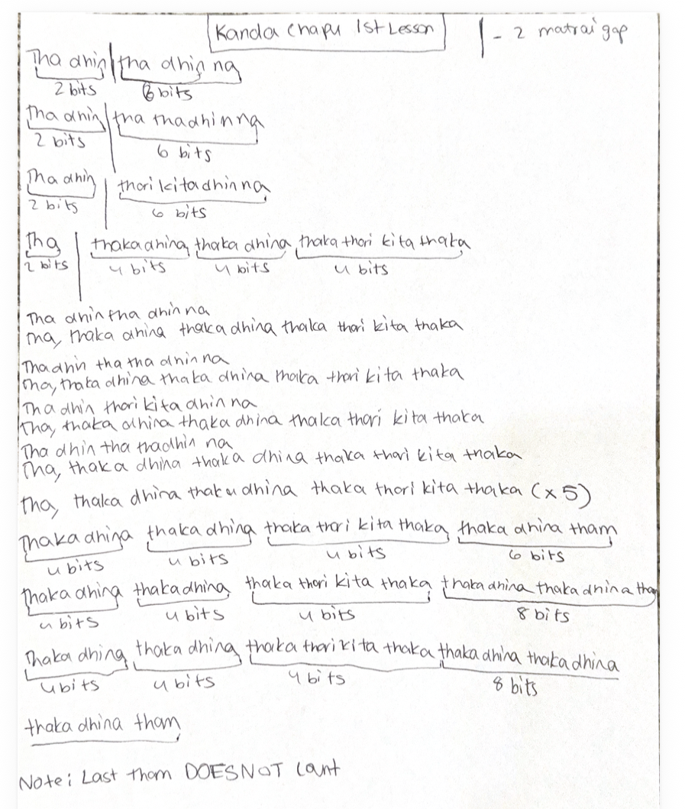

# Lesson 9: Kanda Chapu

[⬅ Back to Carnatic Lessons](carnatic-lessons.md)

---

## What is Kanda Chapu?

Kanda Chapu is a chapu tala in Carnatic music known for its uneven and flowing rhythmic structure.  
It typically follows a **5-beat cycle**, which makes it different from more symmetrical tala structures.

In this lesson, I practiced patterns based on Kanda Chapu and focused on maintaining correct internal grouping and timing.

---

## Tala Structure (Kanda Chapu)

Kanda Chapu is commonly grouped as:

2 + 3

Count example:
1 2 | 3 4 5

This uneven grouping creates a unique rhythmic feel and requires careful counting and control.

---

## Original Handwritten Notes

---

## Download Original Notes (PDF)
[Open PDF](pdf/kandachapu-lesson1.pdf)

---

## Patterns I Practiced (typed from notes)

(Paste Rishi’s exact Kanda Chapu patterns here from notebook — do not modify wording)

---

## Understanding the Structure

While practicing Kanda Chapu, I noticed:

- the 2+3 grouping helps maintain flow  
- internal counting is important to stay aligned  
- each cycle must complete before repeating  
- correct landing maintains rhythm balance  

This helped me understand how uneven groupings create different rhythmic movement.

---

## Thinking in Groupings and Cycles

Grouping the cycle as 2+3 made it easier to track and repeat.

Instead of counting straight 1–5, grouping helps maintain structure and consistency across cycles.

---

## Early Connections I Notice (Patterns & Logic)

Kanda Chapu involves structured repetition with uneven grouping.

Maintaining rhythm requires:
- accurate counting  
- structured grouping (2+3)  
- cycle completion  
- consistent timing  

This feels similar to pattern-based systems where structure and alignment are important.

---

## Reflection (to be added gradually)

I will continue adding observations as I practice Kanda Chapu and improve timing and control.
