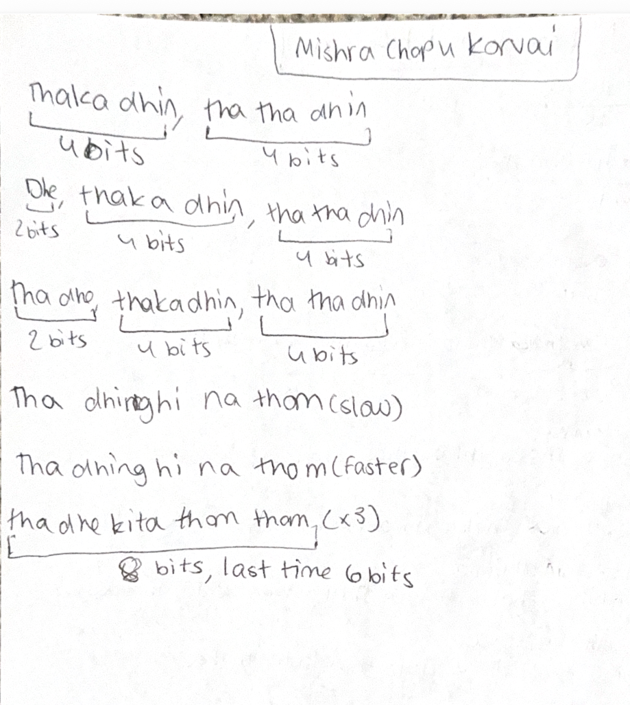

# Lesson 8: Mishra Chapu Korvai

[⬅ Back to Carnatic Lessons](carnatic-lessons.md)

---

## What is a Korvai in Mishra Chapu?

A korvai is a structured rhythmic pattern that repeats and resolves at the correct point in a tala cycle.

In this lesson, I practiced a korvai in Mishra Chapu.  
The goal was to maintain repetition, structure, and accurate landing at the end of the cycle.

---

## Tala Structure (Mishra Chapu)

Mishra Chapu follows a 7-beat cycle typically grouped as:

3 + 2 + 2

Count example:
1 2 3 | 4 5 | 6 7

The korvai must align correctly within this structure and resolve at the right point.

---

## Original Handwritten Notes

---

## Download Original Notes (PDF)
[Open PDF](docs/mishrachapu-korvai.pdf)

---

## Patterns I Practiced (typed from notes)

(Paste Rishi’s exact handwritten korvai patterns here — do not modify wording)

---

## Understanding the Structure

While practicing this korvai, I noticed:

- patterns repeat in structured sequences  
- repetition must stay aligned with tala  
- final landing must match the cycle start  
- internal counting is required for accuracy  

This helped improve timing and consistency.

---

## Thinking in Repetition and Cycles

A korvai is built using repeating rhythmic phrases:

pattern → repeat → repeat → final landing  

Maintaining alignment across repetitions ensures the korvai resolves correctly within the tala.

---

## Early Connections I Notice (Patterns & Logic)

Practicing korvai patterns requires:

- structured repetition  
- accurate counting  
- cycle alignment  
- consistent timing  

These ideas relate to structured sequences where repetition and alignment must remain precise.

---

## Reflection (to be added gradually)

I will continue adding observations as I practice and understand Mishra Chapu korvai patterns more deeply.
