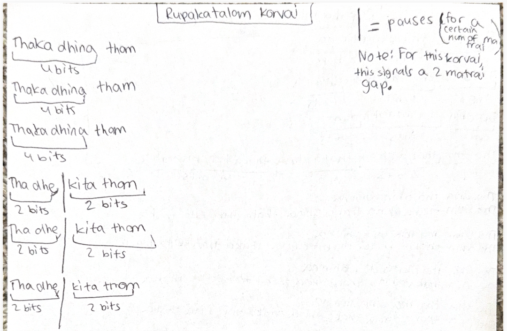

# Lesson 6: Rupaka Tala Korvai

[⬅ Back to Carnatic Lessons](carnatic-lessons.md)

---

## What is a Korvai in Rupaka Tala?

A korvai is a structured rhythmic pattern that repeats and resolves precisely within a tala cycle.

In this lesson, I practiced a korvai in Rupaka Tala and focused on:

• repetition  
• structure  
• counted pauses  
• correct final landing  

The goal of a korvai is not just to repeat phrases, but to ensure the full structure resolves exactly at the starting point of the tala cycle.

---

## Korvai Structure (Rupaka Tala Koravi )

Rupaka Tala follows a repeating rhythmic cycle that must remain balanced.

Example grouping:  
1 2 | 3 4 | 5 6

Each korvai must stay aligned within this cycle and resolve correctly on the starting beat (samam).

Even a small counting error can shift the final landing.

---

## Original Handwritten Notes

These are my original handwritten practice notes from class.

---

## Download Original Notes (PDF)

[Open PDF](docs/rupakathalam-korvai.pdf)

---

## Patterns I Learned (typed from my notes)

This Rupaka Tala korvai begins with a repeated phrase:

**Thaka dhina thom**  
(4 beats)

This phrase is played three times:

4 + 4 + 4

After this, a shorter grouped phrase follows:

Tha dhe | kita thom  
2 beats 2 beats

This section repeats as part of the korvai structure.

Important:  
In this korvai, the vertical line **|** represents a pause.

For this lesson, the pause equals **2 matrais**.

Even though no syllable is played during the pause, it must still be counted as part of the total structure.

The korvai must resolve correctly at the starting point of the cycle after accounting for:

• repetition  
• grouped phrases  
• pause  

## Understanding the Korvai Structure

While practicing this Rupaka Tala korvai, I observed that repetition must remain aligned with the tala cycle.

A korvai usually follows a structured sequence:

pattern → repeat → repeat → final landing

Each repetition must remain perfectly aligned with the tala.  
The final phrase must land exactly at the starting point of the cycle.

This requires careful counting, prediction, and consistency.

---

## How the Pause Affects the Structure

One unique aspect of this korvai is the **2-matrai pause**.

Even though no sound is played during the pause, it must still be counted.

This means rhythm includes both:

• sound  
• controlled silence  

If the pause is not counted correctly, the final landing will not align with the tala cycle.

This helped me understand that structure in rhythm includes both action and intentional gaps.

---

## Thinking in Repetition and Cycles

A korvai is built using repeated rhythmic phrases.

pattern → repeat → repeat → final landing

This creates a structured sequence that must resolve correctly within the tala.

Practicing this strengthened my ability to:

• track repetition  
• maintain alignment  
• predict resolution points  
• execute with accuracy  

---

## How I Structured This Korvai

While practicing this korvai, I broke each phrase into counted units such as:

• 4-beat groupings  
• 2-beat groupings  
• pause counts  

This helped me clearly see:

• how long each phrase is  
• how repetition changes total length  
• where pauses occur  
• where final landing must happen  

Instead of memorizing only by sound, I began thinking in counted structure.

This made it easier to predict whether the korvai would resolve correctly.

---

## Repetition and Mathematical Planning

Because the phrase repeats multiple times, I must calculate:

phrase length  
× number of repetitions  
+ pause  
= total structure

If the total does not align with the tala cycle, the korvai will not resolve correctly.

This showed me that korvai requires planning and calculation, not just repetition.

---

## Structural Logic I Observed

This lesson helped me notice several structural ideas.

### Mathematical thinking
• working with fixed totals  
• grouping numbers into units  
• scaling structures through repetition  
• tracking totals across sequences  
• adjusting patterns to maintain balance  

### Logical / computational thinking
• repeated phrases behave like loops  
• pauses act like controlled timing gaps  
• grouped phrases act like building blocks  
• full structure must resolve correctly before repeating  

---

## What This Helped Me Realize

Learning this korvai showed me that rhythm is not only about playing patterns.

It requires:

• prediction  
• planning  
• counting accuracy  
• structured execution  

A korvai must be designed before it is played.

## This strengthened my ability to:

• think ahead  
• calculate totals  
• adjust structures  
• execute with precision  

I began to see rhythm as a structured system built on logic and planning.

---

## Structural Breakdown of This Korvai

First phrase: 4 + 4 + 4  
Transition phrase: 2 + 2  
Pause: 2 matrais  

All components must be counted correctly so the korvai lands precisely on samam.

This requires planning before execution.

---

## Where This Is Leading

As I continue learning more tala structures and korvais, I want to understand:

• how rhythmic systems scale  
• how structure remains stable as patterns grow  
• how repetition and logic work together  

Over time, I hope to connect these ideas more clearly with:

• mathematical thinking  
• system design  
• computer science concepts  
• real-world structured problem solving  

This is an ongoing learning process, and I will continue documenting what I observe.

---

## Music, Math, and Computer Science Connection

This lesson connects to mathematical and computational thinking.

See full connections here:  
➡️ [Music → Math → Computer Science Connections](music-math-cs-connections.md)

