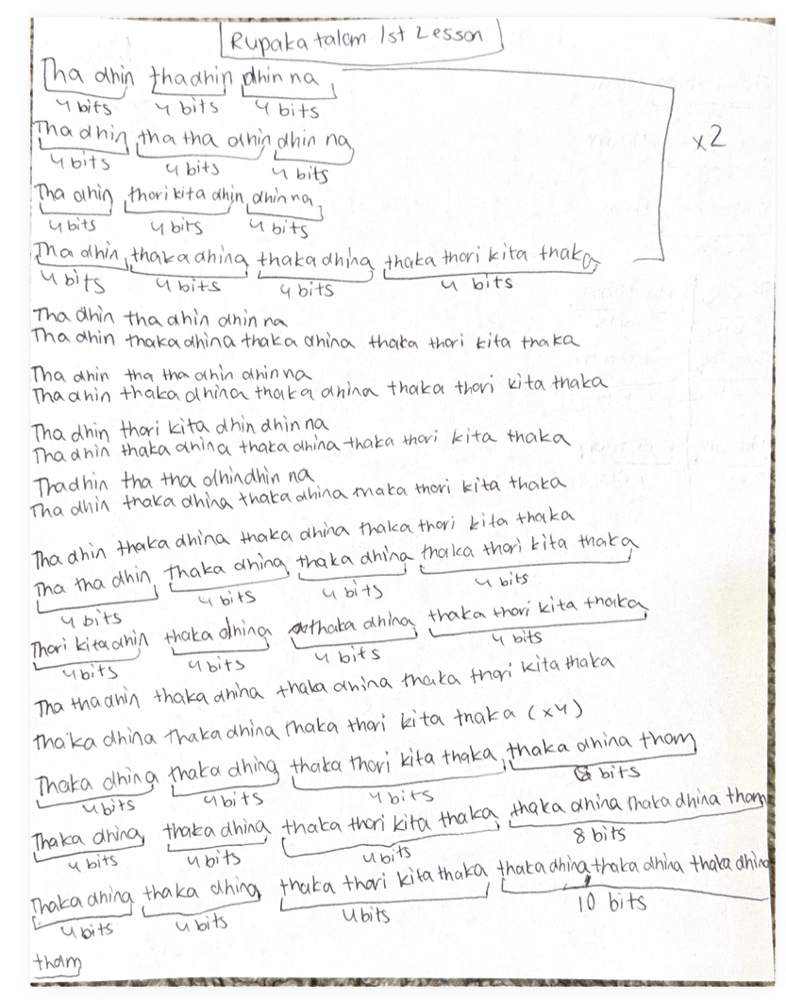

# Lesson 5: Rupaka Tala

[⬅ Back to Carnatic Lessons](carnatic-lessons.md)

---

## What is Rupaka Tala?

Rupaka Tala is an important rhythmic cycle in Carnatic music.  
It has a structured pattern that helps maintain balance and timing within compositions and practice exercises.

In this lesson, I practiced rhythm patterns based on Rupaka Tala and focused on maintaining correct alignment within the cycle.

---

## Tala Structure

Rupaka Tala is commonly practiced as a 3-beat or 6-beat cycle depending on structure and speed.

Example structure:
1 2 | 3 4 | 5 6

Each pattern must align correctly within the tala and repeat with consistency.

---

## Original Handwritten Notes

These are my original handwritten practice notes from class.

---

## Download Original Notes (PDF)
[Open PDF](docs/rupakathalam-lesson1.pdf)

---

## Patterns I Learned (typed from my notes)

Each of the following patterns fits within the Rupaka Tala cycle.

Tha ki ta | Tha ka dhi mi  
Tha dhin gi na thom | Tha ki ta  
Tha ka dhi mi | Tha ka jo nu  
Tha dhin gi na thom | Tha dhin gi na thom  

Each pattern must stay aligned within the Rupaka Tala structure and resolve correctly before repeating.

## Understanding the Rupaka Tala Structure

While practicing Rupaka Tala, I noticed that the grouping feels different from Adi Tala because of its structure.

Common groupings include:

3 + 2 + 2  
or  
6-beat flowing structure  

Even though the grouping feels different, the cycle must remain balanced and complete before repeating.

This helped me understand how different tala structures create different rhythmic flow and balance.

## Thinking in Cycles and Groupings

Practicing Rupaka Tala required careful counting and repetition.

I noticed that:

- grouping helps maintain structure  
- repetition improves consistency  
- alignment ensures correct rhythm flow  

Each completed cycle reinforces timing and structure.

Early Connections I Notice (Patterns & Logic)

## Rupaka Tala involves repeating structured cycles.

Maintaining rhythm requires:

- counting  
- grouping  
- consistent repetition  
- correct cycle completion  

These ideas are similar to pattern-based thinking where structure and timing must remain consistent.

## What This Helped Me Realize

Practicing Rupaka Tala helped me become more aware of how structure and grouping affect rhythm.

Even when patterns change, the cycle must stay balanced and return to the starting point correctly.

This strengthened my ability to:

- think in grouped units  
- maintain alignment across cycles  
- recognize patterns and structure  
- stay consistent across repetition  

I began to see rhythm not just as sound, but as a structured system that must stay balanced while allowing variation inside it.

## Where This Is Leading

As I continue learning more tala structures and korvais, I want to understand how rhythmic systems scale and stay structured even as patterns become more complex.

Over time, I hope to connect these ideas more clearly with mathematical thinking, system design, and real-world structured problem solving.

This is an ongoing learning process, and I plan to keep documenting what I observe and understand.

---

### Music, Math, and Computer Science Connection

This lesson connects to mathematical and computational thinking.

See full connections here:  
➡️ [Music → Math → Computer Science Connections](music-math-cs-connections.md)
